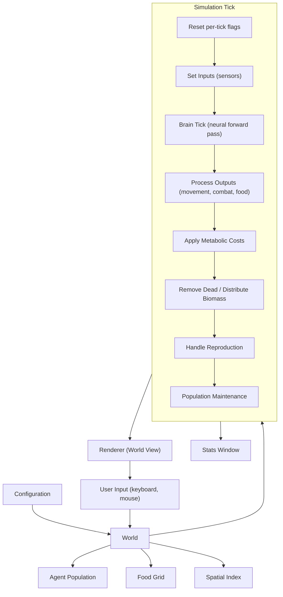

# ScriptBots: Artificial Life Simulation Design Document

> **Purpose**: This document is a language-agnostic, implementation-independent specification of the ScriptBots artificial life simulation. It is intended as a complete blueprint for rebuilding the simulation from scratch in any programming language or graphics framework. Every algorithm is described in pseudocode, every parameter is documented with its default value and purpose, and every subsystem's inputs and outputs are explicitly defined.

> **How to use this document**: Each numbered section is self-contained and can be referenced independently. Section 8 (Configuration Reference) is the single source of truth for all tunable parameters. Pseudocode uses generic constructs (lists, maps, structs) with no language-specific idioms.

---

## Table of Contents

1. [Simulation Overview](#1-simulation-overview)
2. [World Environment](#2-world-environment)
3. [Agent Design](#3-agent-design)
4. [Neural Network (Brain)](#4-neural-network-brain)
5. [Evolution System](#5-evolution-system)
6. [Visualization and GUI](#6-visualization-and-gui)
7. [User Interaction](#7-user-interaction)
8. [Configuration Reference](#8-configuration-reference)
9. [Emergent Dynamics and Design Intent](#9-emergent-dynamics-and-design-intent)

---

## 1. Simulation Overview

### 1.1 Purpose and Design Goals

ScriptBots is an artificial life simulator (originally by Andrej Karpathy) in which autonomous agents with evolving neural networks compete for survival in a 2D world. The simulation demonstrates:

- **Emergent behavior** arising from simple neural-network-driven agents
- **Neuroevolution** through mutation and crossover of recurrent neural networks
- **Predator-prey dynamics** between herbivore and carnivore phenotypes
- **Natural selection** driven by finite resources and combat

There is no explicit fitness function. Fitness is implicit: agents that eat, survive, and reproduce pass their genes on. Everything else is emergent.

### 1.2 High-Level Architecture



### 1.3 Core Simulation Loop (per tick)

Each tick executes the following steps in order:

1. **Increment tick counter** (`modcounter++`)
2. **Periodic events** (aging every 100 ticks, population history every 1000 ticks, epoch rollover every 10000 ticks)
3. **Reset per-tick flags** (clear `spiked` flag on all agents)
4. **Set inputs** -- populate each agent's 24-element sensor vector from the world state
5. **Brain tick** -- run one forward pass of every agent's neural network (parallelizable)
6. **Process outputs** -- interpret the 9-element output vector: movement, color, spike, boost, sound, food giving; handle food consumption, food sharing, spike combat
7. **Apply metabolic costs** -- deduct base health cost (boosted agents pay more)
8. **Decay indicators** -- visual event indicators count down
9. **Remove dead agents** -- distribute killed agents' biomass to nearby carnivores, then erase dead agents from the population
10. **Track lineage extinctions** -- detect lineages whose population dropped to zero
11. **Handle reproduction** -- eligible agents produce offspring with mutation
12. **Population maintenance** -- in open environments, inject random or crossover agents to maintain minimum population

### 1.4 Time Units

| Unit | Duration | Notes |
|------|----------|-------|
| Tick | 1 call to `update()` | Smallest time unit |
| Age increment | Every 100 ticks | `agent.age += 1` |
| Population snapshot | Every 1000 ticks | Herbivore/carnivore counts recorded |
| Epoch | Every 10000 ticks | `modcounter` resets to 0, `epoch` increments |

---

## 2. World Environment

### 2.1 Geometry

- **Dimensions**: 2D plane, `WIDTH` x `HEIGHT` pixels (default 4000 x 2500)
- **Coordinate system**: Continuous floating-point, origin at top-left corner
- **Topology**: Toroidal (wrapping) -- agents leaving one edge reappear on the opposite edge
- **Wrapping logic**:

```
if position.x < 0:          position.x += WIDTH
if position.x >= WIDTH:     position.x -= WIDTH
if position.y < 0:          position.y += HEIGHT
if position.y >= HEIGHT:    position.y -= HEIGHT
```

- **No terrain or elevation**: The world is uniform except for the food distribution

### 2.2 Food System

The food layer is a discrete grid overlaid on the continuous world.

**Grid structure**:
- Cell size: `CZ` pixels (default 50)
- Grid dimensions: `FW = WIDTH / CZ`, `FH = HEIGHT / CZ`
- Each cell stores a single float representing food quantity, range `[0, FOODMAX]`

**Initialization**:
- A proportion (`PROP_INIT_FOOD_FILLED`, default 10%) of all cells are randomly selected and set to `FOODMAX`
- All other cells start at 0

**Food generation** (periodic):
- Every `FOODADDFREQ` ticks (default 45), one random cell is set to `FOODMAX`
- Food appears instantly at full value (no gradual growth)

**Food consumption** (by herbivores):

```
cx = floor(agent.position.x / CZ)
cy = floor(agent.position.y / CZ)
f = food[cx][cy]

if f > 0 AND agent.health < 2.0:
    intake = min(f, FOODINTAKE)
    speed_efficiency = (1 - (|agent.w1| + |agent.w2|) / 2) * 0.7 + 0.3
    effective_intake = intake * agent.herbivore * speed_efficiency
    agent.health += effective_intake
    agent.repcounter -= 3 * effective_intake
    food[cx][cy] -= min(f, FOODWASTE)
```

Key design notes:
- Slower agents eat more efficiently (encourages stopping to eat)
- Only herbivores benefit significantly (multiplied by `agent.herbivore`)
- Eating progresses the reproduction counter
- Food is wasted during consumption (`FOODWASTE` destroyed per eating event)

**Food sharing** (between agents):

```
if agent.give > 0.5:
    for each nearby_agent within FOOD_SHARING_DISTANCE:
        if nearby_agent.health < 2.0:
            nearby_agent.health += FOODTRANSFER
            agent.health -= FOODTRANSFER
```

**Biomass distribution on death** (only for agents killed by spike attack):

```
if dead_agent.health <= 0 AND dead_agent.spiked:
    age_multiplier = min(dead_agent.age * 0.2, 1.0)   // young agents give little
    count = number of living agents within FOOD_DISTRIBUTION_RADIUS

    if count > 0:
        for each living_agent within FOOD_DISTRIBUTION_RADIUS:
            carnivore_factor = (1 - living_agent.herbivore)^2
            share = 5 * carnivore_factor / count^1.25 * age_multiplier
            living_agent.health += share                    // capped at 2.0
            living_agent.repcounter -= REPMULT * carnivore_factor / count^1.25 * age_multiplier
```

Design intent: Only carnivores benefit meaningfully from kills. Agents that die of natural causes give no biomass, preventing "sit and wait" strategies.

### 2.3 Spatial Partitioning

A grid-based spatial index accelerates neighbor queries from O(N^2) to approximately O(N).

**Structure**:
- A 2D grid of cells, each containing a list of agent references
- A hash map from agent reference to its current cell coordinates (for O(1) removal)
- Cell size: `DIST * 0.8` (80% of vision distance)
- Grid dimensions: `ceil(WIDTH / cell_size)` x `ceil(HEIGHT / cell_size)`

**Operations**:

| Operation | Description |
|-----------|-------------|
| `addAgent(agent)` | Insert agent into the cell corresponding to its position |
| `removeAgent(agent)` | Remove agent using hash map for O(1) cell lookup |
| `updateAgent(agent, oldX, oldY)` | If agent moved to a different cell, remove from old and add to new |
| `getNearbyAgents(x, y, radius)` | Return all agents within `radius`, checking cells in bounding box |

**Wrapping in neighbor queries**: Grid coordinates wrap using modular arithmetic. Distance calculation uses the shortest path across toroidal boundaries:

```
dx = agent.x - query.x
dy = agent.y - query.y
if dx > WIDTH / 2:    dx -= WIDTH
if dx < -WIDTH / 2:   dx += WIDTH
if dy > HEIGHT / 2:   dy -= HEIGHT
if dy < -HEIGHT / 2:  dy += HEIGHT
distance = sqrt(dx^2 + dy^2)
```

### 2.4 Time System

**Tick counter** (`modcounter`): Increments by 1 each tick. Resets to 0 every 10000 ticks.

**Epoch counter** (`current_epoch`): Increments when `modcounter` resets.

**Periodic event schedule**:

| Frequency | Event |
|-----------|-------|
| Every tick | Neural processing, movement, combat, metabolism |
| Every 2 ticks | Spike collision detection (performance optimization) |
| Every 15 ticks | Reproduction eligibility check |
| Every `FOODADDFREQ` ticks (45) | Food cell spawned at random location |
| Every 100 ticks | Agent aging (`age += 1`); open-environment population injection |
| Every 1000 ticks | Population history snapshot; report writing; auto-save check |
| Every 10000 ticks (epoch boundary) | Epoch increment; random agent spawning; extinction recovery |

### 2.5 Population Management

**Closed environment** (`CLOSED = true`, default):
- No automatic agent injection during normal ticks
- Population is self-sustaining through reproduction only
- Extinction recovery still active at epoch boundaries

**Open environment** (`CLOSED = false`):
- Minimum population maintained at `NUMBOTS`
- Every 100 ticks: 50% chance of adding a random agent, 50% chance of adding a crossover agent
- If population drops below `NUMBOTS`, random agents added immediately

**Epoch-level events** (always active):
- Every `RANDOM_SPAWN_EPOCH_INTERVAL` epochs: inject `RANDOM_SPAWN_COUNT` random agents
- If herbivore population = 0: spawn `HERBIVORE_EXTINCTION_REPOPULATION_COUNT` herbivores
- If carnivore population = 0: spawn `CARNIVORE_EXTINCTION_REPOPULATION_COUNT` carnivores

**Crossover agent injection** (open environment):
- Two parents selected from the population, biased toward older (more successful) agents
- Selection: Start with random agents; iterate through population, replacing with older agents with 10% probability
- Offspring created via crossover (see Section 5.3)

---

## 3. Agent Design

### 3.1 Agent State

All agent attributes, grouped by category:

#### Physical State

| Attribute | Type | Range | Initial Value | Description |
|-----------|------|-------|---------------|-------------|
| `position` | 2D vector | [0,WIDTH) x [0,HEIGHT) | Random | World coordinates |
| `angle` | float | [-pi, pi] | Random | Facing direction in radians |
| `health` | float | [0, 2] | 1.0 + random(0, 0.1) | Energy/life. Death at 0 |
| `age` | int | [0, inf) | 0 | Incremented every 100 ticks |
| `id` | int | [0, inf) | Auto-increment | Unique identifier |

#### Visual Appearance (set by neural outputs each tick)

| Attribute | Type | Range | Description |
|-----------|------|-------|-------------|
| `red` | float | [0, 1] | Red color component |
| `gre` | float | [0, 1] | Green color component |
| `blu` | float | [0, 1] | Blue color component |
| `spikeLength` | float | [0, 1] | Attack appendage extension |

#### Movement

| Attribute | Type | Range | Description |
|-----------|------|-------|-------------|
| `w1` | float | [0, 1] | Left wheel speed (from neural output, sigmoid range) |
| `w2` | float | [0, 1] | Right wheel speed (from neural output, sigmoid range) |
| `boost` | bool | true/false | Speed multiplier active when output[6] > 0.5 |

#### Neural Interface

| Attribute | Type | Size | Description |
|-----------|------|------|-------------|
| `in` | float array | INPUTSIZE (24) | Sensor input vector |
| `out` | float array | OUTPUTSIZE (9) | Action output vector |
| `brain` | MLPBrain | -- | Neural network instance |

#### Genetic Traits (heritable, mutable)

| Attribute | Type | Initial Range | Description |
|-----------|------|---------------|-------------|
| `herbivore` | float | [0, 1] | Diet type. 0 = pure carnivore, 1 = pure herbivore |
| `MUTRATE1` | float | [0.001, 0.005] | Mutation frequency (probability per neuron) |
| `MUTRATE2` | float | [0.03, 0.07] | Mutation magnitude (std dev of Gaussian perturbation) |
| `clockf1` | float | [5, 100] | Internal clock 1 frequency |
| `clockf2` | float | [5, 100] | Internal clock 2 frequency |
| `smellmod` | float | [0.1, 0.5] | Smell sensor gain |
| `soundmod` | float | [0.2, 0.6] | Movement-sound sensor gain |
| `hearmod` | float | [0.7, 1.3] | Hearing sensor gain |
| `eyesensmod` | float | [1, 3] | Eye sensitivity multiplier |
| `bloodmod` | float | [1, 3] | Blood sensor gain |
| `eyefov` | float array | [0.5, 2] per eye | Field of view in radians, per eye |
| `eyedir` | float array | [0, 2*pi] per eye | Look direction in radians, per eye |

#### Reproduction

| Attribute | Type | Description |
|-----------|------|-------------|
| `repcounter` | float | Countdown to reproduction eligibility. Ready when < 0 |
| `gencount` | int | Generation number (parent's + 1) |
| `hybrid` | bool | True if this agent was created by crossover |
| `lineageTag` | string | 5-character alphabetic tag (e.g., "ABCDE") |

#### Communication

| Attribute | Type | Range | Description |
|-----------|------|-------|-------------|
| `soundmul` | float | [0, 1] | Active sound emission level (from output[7]) |
| `give` | float | [0, 1] | Food giving intent (from output[8]). Active when > 0.5 |

#### Rendering/Debug (not relevant to simulation logic)

| Attribute | Description |
|-----------|-------------|
| `indicator` | Visual event indicator duration countdown |
| `ir, ig, ib` | Indicator color |
| `selectflag` | Whether agent is selected by user |
| `dfood` | Health change from food sharing (for visualization only) |
| `spiked` | Flag: was this agent hit by a spike attack this tick |

### 3.2 Sensory System

Each agent perceives the world through a 24-element input vector, populated each tick before the neural network runs.

#### 3.2.1 Input Vector Layout

| Index | Sensor | Description |
|-------|--------|-------------|
| 0 | Eye 0 proximity | Distance-weighted proximity of visible agents |
| 1 | Eye 0 red | Accumulated red color of visible agents |
| 2 | Eye 0 green | Accumulated green color of visible agents |
| 3 | Eye 0 blue | Accumulated blue color of visible agents |
| 4 | Ground food | Food level at agent's current cell |
| 5 | Eye 1 proximity | (same as eye 0) |
| 6 | Eye 1 red | |
| 7 | Eye 1 green | |
| 8 | Eye 1 blue | |
| 9 | Sound | Movement-based noise from nearby agents |
| 10 | Smell | Proximity-weighted count of nearby agents |
| 11 | Health | Agent's own health level, normalized |
| 12 | Eye 2 proximity | |
| 13 | Eye 2 red | |
| 14 | Eye 2 green | |
| 15 | Eye 2 blue | |
| 16 | Clock 1 | Periodic signal: abs(sin(modcounter / clockf1)) |
| 17 | Clock 2 | Periodic signal: abs(sin(modcounter / clockf2)) |
| 18 | Hearing | Sound output from nearby agents |
| 19 | Blood sensor | Forward-facing low-health detector |
| 20 | Eye 3 proximity | |
| 21 | Eye 3 red | |
| 22 | Eye 3 green | |
| 23 | Eye 3 blue | |

All sensor values are clamped to [0, 1] via `cap()`.

#### 3.2.2 Vision System

Each agent has `NUMEYES` (default 4) eyes. Each eye has:
- `eyedir[q]`: direction offset from agent's facing angle (in radians)
- `eyefov[q]`: field of view half-angle (in radians)

Both are evolvable genetic traits.

**Vision algorithm** (for each nearby agent within `DIST`):

```
for each eye q in [0, NUMEYES):
    eye_angle = agent.angle + agent.eyedir[q]
    normalize eye_angle to [-pi, pi]

    angle_to_neighbor = atan2(neighbor.y - agent.y, neighbor.x - agent.x)

    angular_diff = |eye_angle - angle_to_neighbor|
    if angular_diff > pi:
        angular_diff = 2*pi - angular_diff

    if angular_diff < eyefov[q]:
        weight = eyesensmod * (eyefov[q] - angular_diff) / eyefov[q]
                            * (DIST - distance) / DIST

        proximity[q] += weight * (distance / DIST)
        red[q]       += weight * neighbor.red
        green[q]     += weight * neighbor.gre
        blue[q]      += weight * neighbor.blu
```

Design notes:
- Agents closer to center of FOV contribute more (linear falloff from center)
- Agents closer in distance contribute more (linear falloff from max range)
- Multiple visible agents accumulate (additive)
- Proximity is inverted: closer agents produce smaller proximity values (counter-intuitive but preserved from original design)

#### 3.2.3 Smell

Omnidirectional proximity sensor. Accumulates the presence of all nearby agents:

```
smell_accumulator = 0
for each neighbor within DIST:
    smell_accumulator += (DIST - distance) / DIST

input[10] = cap(smell_accumulator * agent.smellmod)
```

#### 3.2.4 Sound (passive movement noise)

Detects the movement intensity of nearby agents:

```
sound_accumulator = 0
for each neighbor within DIST:
    sound_accumulator += (DIST - distance) / DIST * max(|neighbor.w1|, |neighbor.w2|)

input[9] = cap(sound_accumulator * agent.soundmod)
```

#### 3.2.5 Hearing (active sound emission)

Detects the intentional sound output of nearby agents:

```
hearing_accumulator = 0
for each neighbor within DIST:
    hearing_accumulator += neighbor.soundmul * (DIST - distance) / DIST

input[18] = cap(hearing_accumulator * agent.hearmod)
```

#### 3.2.6 Blood Sensor

Forward-facing sensor that detects wounded agents:

```
blood_accumulator = 0
forward_angle = agent.angle
threshold_angle = 3 * pi / 16    // approximately 33.75 degrees

for each neighbor within DIST:
    angle_to_neighbor = atan2(neighbor.y - agent.y, neighbor.x - agent.x)
    angular_diff = |forward_angle - angle_to_neighbor|
    if angular_diff > pi: angular_diff = 2*pi - angular_diff

    if angular_diff < threshold_angle:
        weight = (threshold_angle - angular_diff) / threshold_angle
               * (DIST - distance) / DIST
        blood_accumulator += weight * (1 - neighbor.health / 2)

input[19] = cap(blood_accumulator * agent.bloodmod)
```

Agents with low health "bleed" more (health is in [0,2], so `1 - health/2` ranges from 0 to 1).

#### 3.2.7 Internal Sensors

| Input | Formula | Description |
|-------|---------|-------------|
| `in[4]` | `food[cx][cy] / FOODMAX` | Ground food at agent's position |
| `in[11]` | `cap(health / 2)` | Own health, normalized to [0,1] |
| `in[16]` | `abs(sin(modcounter / clockf1))` | Internal clock 1 oscillation |
| `in[17]` | `abs(sin(modcounter / clockf2))` | Internal clock 2 oscillation |

The clock signals provide a sense of time, enabling periodic behaviors. Their frequencies are evolvable traits.

### 3.3 Action System

The neural network produces a 9-element output vector, interpreted as follows:

#### 3.3.1 Output Vector Layout

| Index | Action | Range | Description |
|-------|--------|-------|-------------|
| 0 | Left wheel (w1) | [0, 1] | Left wheel speed |
| 1 | Right wheel (w2) | [0, 1] | Right wheel speed |
| 2 | Red | [0, 1] | Body color red component |
| 3 | Green | [0, 1] | Body color green component |
| 4 | Blue | [0, 1] | Body color blue component |
| 5 | Spike target | [0, 1] | Target spike extension length |
| 6 | Boost | [0, 1] | Boost active when > 0.5 |
| 7 | Sound | [0, 1] | Sound emission multiplier |
| 8 | Give | [0, 1] | Food giving active when > 0.5 |

#### 3.3.2 Movement: Differential Drive Model

Agents move using a two-wheeled differential drive, producing both translation and rotation.

```
// Wheel positions (perpendicular to facing direction)
perpendicular = Vector2(BOTRADIUS / 2, 0).rotate(agent.angle + pi/2)
left_wheel_pos  = agent.position + perpendicular
right_wheel_pos = agent.position - perpendicular

// Wheel speeds (with optional boost)
BW1 = BOTSPEED * agent.w1
BW2 = BOTSPEED * agent.w2
if agent.boost:
    BW1 *= BOOSTSIZEMULT
    BW2 *= BOOSTSIZEMULT

// Left wheel rotation: rotate position around right wheel
offset = right_wheel_pos - agent.position
offset.rotate(-BW1)
agent.position = right_wheel_pos - offset
agent.angle -= BW1

// Right wheel rotation: rotate position around left wheel
offset = agent.position - left_wheel_pos
offset.rotate(BW2)
agent.position = left_wheel_pos + offset
agent.angle += BW2

// Normalize angle to [-pi, pi]
// Apply toroidal wrapping to position
```

Behavior:
- Both wheels same speed -> straight line
- One wheel faster -> turns
- Both wheels zero -> stationary
- The output range [0,1] means agents naturally move forward (both positive); pure reverse or differential reverse is not possible in this design

#### 3.3.3 Combat: Spike System

Agents can extend a spike to attack other agents.

**Spike dynamics** (every tick):

```
target = agent.out[5]
if agent.spikeLength < target:
    agent.spikeLength += SPIKESPEED       // slow extension
else:
    agent.spikeLength = target             // instant retraction
```

**Attack detection** (every 2 ticks, for performance):

Preconditions for an agent to be an attacker:
- `herbivore <= 0.8` (mostly carnivore)
- `spikeLength >= 0.2` (spike sufficiently extended)
- `w1 >= 0.5 AND w2 >= 0.5` (moving forward with some speed)

```
for each attacker meeting preconditions:
    for each candidate within 2 * BOTRADIUS (collision distance):
        facing_vector = Vector2(1, 0).rotate(attacker.angle)
        angle_to_target = facing_vector.angle_between(candidate.position - attacker.position)

        if |angle_to_target| < pi/8:        // aligned within 22.5 degrees
            boost_mult = BOOSTSIZEMULT if attacker.boost else 1.0
            damage = SPIKEMULT * attacker.spikeLength
                   * max(|attacker.w1|, |attacker.w2|) * BOOSTSIZEMULT

            candidate.health -= damage
            attacker.spikeLength = 0         // retract after hit
            candidate.spiked = true          // mark as killed-by-spike

            // Back-attack advantage: if attacker is behind victim
            victim_facing = Vector2(1, 0).rotate(candidate.angle)
            if |facing_vector.angle_between(victim_facing)| < pi/2:
                candidate.spikeLength = 0    // startle: retract victim's spike
```

#### 3.3.4 Communication

**Active sound**: `agent.soundmul = out[7]` -- detected by other agents' hearing sensors.

**Color signaling**: `agent.red/gre/blu = out[2]/out[3]/out[4]` -- visible to other agents' eyes. Can be used for species recognition, signaling, or camouflage.

**Food sharing**: When `out[8] > 0.5`, the agent transfers `FOODTRANSFER` health per tick to each agent within `FOOD_SHARING_DISTANCE`.

### 3.4 Metabolism

**Base metabolic cost** (every tick):

```
base_loss = 0.0002

if agent.boost:
    agent.health -= base_loss * BOOSTSIZEMULT * 1.3
else:
    agent.health -= base_loss
```

Boost is expensive: it multiplies the metabolic cost by `BOOSTSIZEMULT * 1.3`.

**Health bounds**: Maximum health is 2.0 (capped after eating or receiving biomass). Death occurs at health <= 0.

**Energy sources**:

| Source | Benefit To | Formula |
|--------|------------|---------|
| Ground food | Herbivores | `FOODINTAKE * herbivore * speed_efficiency` per tick |
| Kill biomass | Carnivores | `5 * (1-herbivore)^2 / count^1.25 * age_mult` on kill |
| Food sharing | Any | `FOODTRANSFER` per tick per nearby sharing agent |

### 3.5 Lifecycle

**Birth**:
- Random agents: position random in world, angle random, health ~1.0, age 0, all traits randomized within initial ranges
- Offspring: positioned near parent (behind, to avoid immediate eating), inherits parent's traits with mutation
- Lineage tag: new random tag for random agents; inherited from parent for offspring

**Aging**: `age` increments by 1 every 100 ticks. There is no maximum age or age-based death.

**Death conditions**:
- `health <= 0` (from metabolic drain, combat damage, or food sharing drain)

**Death processing**:
1. If `spiked` flag is true (killed by combat): distribute biomass to nearby agents (see Section 2.2)
2. Remove from spatial index
3. Remove from population list
4. Track lineage extinction if this was the last agent of its lineage

---

## 4. Neural Network (Brain)

The brain is a "Damped Weighted Recurrent AND/OR Network" -- a fully recurrent neural network where every neuron can connect to any other (including itself), with temporal damping and two types of synapses.

### 4.1 Architecture

**Neuron (MLPBox) structure**:

| Field | Type | Description |
|-------|------|-------------|
| `w` | float array [CONNS] | Connection weights |
| `id` | int array [CONNS] | Target neuron indices (which neurons this one reads from) |
| `type` | int array [CONNS] | Synapse type: 0 = standard, 1 = change-sensitive |
| `kp` | float | Damping coefficient (controls how quickly output approaches target) |
| `gw` | float | Global weight multiplier (scales all incoming signals) |
| `bias` | float | Neuron bias |
| `target` | float | Target activation (sigmoid output before damping) |
| `out` | float | Current output activation |
| `oldout` | float | Previous tick's output (for change-sensitive synapses) |

**Network layout** (total `BRAINSIZE` neurons, default 85):

```
[  INPUT neurons  |  HIDDEN neurons  |  OUTPUT neurons  ]
   (first 24)       (middle 52)        (last 9)
```

- Input neurons (indices 0 to INPUTSIZE-1): Their `out` is directly set from the sensor input vector each tick. They do not compute activations.
- Hidden neurons (indices INPUTSIZE to BRAINSIZE-OUTPUTSIZE-1): Compute activations using the standard forward pass.
- Output neurons (indices BRAINSIZE-OUTPUTSIZE to BRAINSIZE-1): Same computation as hidden, but their `out` values are read as the action output vector.

**Output mapping**: Output index `i` reads from neuron index `BRAINSIZE - 1 - i` (reversed order).

**Connectivity**:
- Each neuron has exactly `CONNS` (default 3) outgoing connections
- Connections can target any neuron in the network (fully recurrent)
- Connection targets are stored as indices into the neuron array

### 4.2 Forward Pass

Executed once per tick:

```
// Step 1: Set input neuron outputs from sensor data
for i in [0, INPUTSIZE):
    neurons[i].out = input_vector[i]

// Step 2: Compute target activations for non-input neurons
for i in [INPUTSIZE, BRAINSIZE):
    neuron = neurons[i]
    accumulator = 0

    for j in [0, CONNS):
        source_idx = neuron.id[j]
        if source_idx out of bounds: skip

        value = neurons[source_idx].out

        if neuron.type[j] == 1:          // Change-sensitive synapse
            value = (value - neurons[source_idx].oldout) * 10

        accumulator += value * neuron.w[j]

    accumulator = accumulator * neuron.gw + neuron.bias
    neuron.target = sigmoid(accumulator)    // 1 / (1 + exp(-x))

// Step 3: Back up current outputs
for i in [0, BRAINSIZE):
    neurons[i].oldout = neurons[i].out

// Step 4: Damped update toward target
for i in [INPUTSIZE, BRAINSIZE):
    neurons[i].out += (neurons[i].target - neurons[i].out) * neurons[i].kp

// Step 5: Extract action outputs
for i in [0, OUTPUTSIZE):
    output_vector[i] = neurons[BRAINSIZE - 1 - i].out
```

**Change-sensitive synapses** (type 1):
- Instead of reading the raw output of the source neuron, they read the *change* in output since last tick, amplified by 10x
- This enables detection of temporal patterns: movement onset, flashing colors, etc.
- 5% of synapses are initialized as change-sensitive

**Damping** (`kp`):
- Controls temporal smoothing of neuron output
- `kp = 1.0`: output jumps immediately to target (no damping)
- `kp = 0.01`: output changes very slowly (high inertia)
- This creates a form of memory: neurons retain traces of past activations

### 4.3 Initialization

**Per-neuron initialization**:

| Parameter | Range | Notes |
|-----------|-------|-------|
| `w[j]` | [-3, 3], 50% set to 0 | Sparse initialization |
| `id[j]` | 20% chance: [0, INPUTSIZE); 80%: [0, BRAINSIZE) | Input-biased connectivity |
| `type[j]` | 5% chance: 1; 95%: 0 | Mostly standard synapses |
| `kp` | [0.9, 1.1] | Near-instant response initially |
| `gw` | [0, 5] | Random global weight scale |
| `bias` | [-2, 2] | Random bias |
| `out` | 0 | |
| `oldout` | 0 | |
| `target` | 0 | |

---

## 5. Evolution System

### 5.1 Reproduction Conditions

An agent can reproduce when ALL of the following are true:
- `repcounter < 0` (reproduction timer has elapsed)
- `health > 0.65` (sufficiently healthy)
- `modcounter % 15 == 0` (checked every 15 ticks)
- `random(0, 1) < 0.1` (10% probability per eligible check)

When reproduction triggers:
1. Parent's reproduction counter is reset: `repcounter = herbivore * random(REPRATEH-0.1, REPRATEH+0.1) + (1-herbivore) * random(REPRATEC-0.1, REPRATEC+0.1)`
2. `BABIES` (default 2) offspring are created
3. A rare large-mutation event may occur: 4% chance that `MR` or `MR2` is multiplied by `random(1, 10)` for this reproduction event only

### 5.2 Asexual Reproduction

Offspring creation from a single parent:

**Positioning**:
```
offset = Vector2(BOTRADIUS, 0).rotate(-offspring.angle)
offspring.position = parent.position + offset
                   + random_vector(-2*BOTRADIUS, 2*BOTRADIUS)
apply toroidal wrapping
```
Offspring spawn behind the parent (to prevent immediate eating of young).

**Trait inheritance with mutation**:

```
offspring.gencount = parent.gencount + 1
offspring.lineageTag = parent.lineageTag

// Meta-mutation (10% chance each)
offspring.MUTRATE1 = parent.MUTRATE1
offspring.MUTRATE2 = parent.MUTRATE2
if random(0,1) < 0.1: offspring.MUTRATE1 = normal(parent.MUTRATE1, METAMUTRATE1)
if random(0,1) < 0.1: offspring.MUTRATE2 = normal(parent.MUTRATE2, METAMUTRATE2)
clamp: MUTRATE1 >= 0.001, MUTRATE2 >= 0.02

// Diet (always mutates, small variance)
offspring.herbivore = clamp01(normal(parent.herbivore, 0.03))

// Clock frequencies (probability MR*5 each)
if random(0,1) < MR*5: offspring.clockf1 = normal(parent.clockf1, MR2); clamp >= 2
if random(0,1) < MR*5: offspring.clockf2 = normal(parent.clockf2, MR2); clamp >= 2

// Sensory modifiers (probability MR*5 each)
// smellmod, soundmod, hearmod, eyesensmod, bloodmod
// Each: copy from parent, then with probability MR*5, perturb by normal(0, MR2)

// Eye configuration (probability MR*5 per eye per trait)
// eyefov[i]: perturb by normal(0, MR2), clamp >= 0
// eyedir[i]: perturb by normal(0, MR2), clamp to [0, 2*pi]

// Neural network
offspring.brain = copy(parent.brain)
offspring.brain.mutate(MR, MR2)
```

### 5.3 Sexual Reproduction (Crossover)

Creates offspring by mixing traits from two parents:

```
offspring.hybrid = true
offspring.gencount = min(parent1.gencount, parent2.gencount)

// For each scalar trait: 50% chance from parent1, 50% from parent2
// Traits: clockf1, clockf2, herbivore, MUTRATE1, MUTRATE2,
//         smellmod, soundmod, hearmod, eyesensmod, bloodmod

// Vector traits: entire vector from one parent (50/50)
// Traits: eyefov (all eyes), eyedir (all eyes)

// Lineage tag: 50% from parent1, 50% from parent2

// Brain: neuron-level crossover
offspring.brain = parent1.brain.crossover(parent2.brain)
```

### 5.4 Mutation Mechanics

**Neural network mutation** (`brain.mutate(MR, MR2)`):

For each of the `BRAINSIZE` neurons, with probability `MR` for each mutation type:

| Mutation | Operation | Bounds |
|----------|-----------|--------|
| Bias drift | `bias += normal(0, MR2)` | No bounds |
| Damping adjustment | `kp += normal(0, MR2)` | Clamp to [0.01, 1.0] |
| Global weight shift | `gw += normal(0, MR2)` | Clamp >= 0 |
| Weight perturbation | Random connection: `w[rc] += normal(0, MR2)` | No bounds |
| Synapse type flip | Random connection: `type[rc] = 1 - type[rc]` | 0 or 1 |
| Connectivity rewiring | Random connection: `id[rc] = random(0, BRAINSIZE)` | Valid index |

**Neural network crossover** (`brain.crossover(other)`):

```
new_brain = copy(this.brain)
for each neuron i:
    if random(0,1) < 0.5:
        // Take entire neuron from this parent (already copied)
    else:
        // Replace entire neuron with other parent's neuron
        new_brain.neurons[i] = copy(other.neurons[i])
        // (bias, gw, kp, and all connections)
```

### 5.5 Lineage Tracking

**Lineage tag**: A 5-character uppercase alphabetic string (e.g., "XKQMR") generated randomly for each agent that enters the simulation as a new random agent.

**Inheritance**:
- Asexual reproduction: offspring inherits parent's tag
- Sexual crossover: offspring randomly receives one parent's tag (50/50)

**Tracking data** (maintained by the statistics system):

| Metric | Description |
|--------|-------------|
| Current population | Number of living agents with this tag |
| Max population (all-time) | Peak population this lineage ever reached |
| Total population | Cumulative count of all agents that ever had this tag |
| Average generation | Mean `gencount` of current living members |
| Current oldest age | Age of oldest living member |
| Max age (all-time) | Oldest age any member ever reached |
| Emergence time | Epoch.tick when this lineage first appeared |
| Extinction time | Epoch.tick when population dropped to 0 (or "active") |

---

## 6. Visualization and GUI

### 6.1 Window Architecture

The simulation uses a dual-window display:

**Main window (World View)**:
- Size: `WWIDTH` x `WHEIGHT` (default 1500 x 1000)
- Content: World visualization with agents, food, and interactive overlays
- Title format: "ScriptBots {version} - World View {WIDTH}x{HEIGHT} (FPS: {fps})"

**Stats window (Statistics & Controls)**:
- Size: 900 x 1200 pixels
- Content: Population charts, lineage statistics, control reference
- Split layout: left half = charts + stats, right half = lineage tables

**Rendering loop**:
- The idle callback continuously calls `world.update()` (unless paused)
- Rendering frequency controlled by `skipdraw` parameter (see Section 7.3)
- Both windows use double buffering

### 6.2 World Rendering

**Coordinate transform pipeline**: World coordinates -> Camera transform (translate + scale) -> Screen coordinates

```
screen_x = (world_x + x_translate) * scale + window_width / 2
screen_y = (world_y + y_translate) * scale + window_height / 2
```

**Food rendering**:
- Each food cell drawn as a filled square of size `CZ` x `CZ`
- Color: blue-tinted, darkness proportional to food quantity
- Formula: `color = (0.9 - quantity*0.5/FOODMAX, 0.9 - quantity*0.5/FOODMAX, 1.0 - quantity*0.5/FOODMAX)`
- Higher food = darker blue; empty cells = near-white

**Agent rendering** (per agent):

1. **Body**: Filled circle with radius `BOTRADIUS`, colored by `(red, gre, blu)`
2. **Outline**: Black circle outline; red outline when boost is active
3. **Spike**: Line extending from center in facing direction, length = `3 * BOTRADIUS * spikeLength`, dark red color
4. **Eyes**: `NUMEYES` lines radiating from center, each at `angle + eyedir[q]`, length = `4 * BOTRADIUS`, gray color
5. **Event indicator**: Colored circle with radius `BOTRADIUS + indicator`, fading over time
6. **Food transfer indicator**: Green glow when giving food, red glow when receiving

**Agent info overlay** (toggleable):
- Generation count (black text)
- Age (red-tinted text based on age)
- Health value (black text)
- Reproduction counter (black text)
- Lineage tag (black text)

**Health bar** (toggleable):
- Small vertical bar near agent
- Green fill proportional to health (0-2 range)
- Additional indicators: hybrid marker (blue), type indicator (yellow=herbivore, red=carnivore)

**Selected agent visualization**:
- Yellow selection ring around selected agent
- Neural network input visualization: row of small squares, brightness = input value
- Neural network output visualization: row of small squares, brightness = output value
- Brain state visualization: grid of small squares (8x8px), one per neuron, brightness = activation level, wrapped every 30 neurons

### 6.3 Statistics Window

**Population chart** (top section):
- Line chart with two traces: herbivores (green) and carnivores (red)
- X-axis: time (200 data points, each representing 1000 ticks)
- Y-axis: population count, auto-scaling
- Current time indicated by vertical line at right edge
- Y-axis labels at 0%, 25%, 50%, 75%, 100% of max

**Statistics info** (below chart):
- Total agents, herbivore count, carnivore count
- Current epoch number
- Total food quantity, food tile coverage percentage
- Current FPS

**Current top lineages** (right panel, top 5 by population):

| Column | Description |
|--------|-------------|
| Tag | 5-character lineage identifier |
| Population | Current living count |
| Max Pop | All-time peak population |
| Total Pop | Cumulative population |
| Avg Gen | Average generation of living members |
| Oldest | Current oldest member age |
| Max Age | All-time oldest age |

**Hall of Fame** (right panel, top 20 all-time by total population):

| Column | Description |
|--------|-------------|
| Tag | 5-character lineage identifier |
| Emerged | Epoch.tick when lineage first appeared |
| Extinct | Epoch.tick when lineage went extinct (or "active") |
| Total Pop | Cumulative population |
| Max Pop | Peak population |
| Max Gen | Maximum generation reached |

**Controls reference** (bottom of left panel): Lists all keyboard and mouse controls.

### 6.4 Camera System

**Zoom**:
- Mouse wheel: adjust zoom by +/- 0.03 per click
- Middle mouse drag: fine zoom via vertical mouse movement
- Zoom range: 0.01 to 5.0
- Zoom-to-cursor: adjusts translation to zoom toward the mouse cursor position
- Initial zoom: calculated to fit the entire world in the window

**Pan**:
- Right mouse drag: pan the camera
- Pan speed scales inversely with zoom level for consistent visual speed

**Follow modes**:
- Mode 0: Free camera (manual pan/zoom)
- Mode 1: Follow the oldest agent (camera centers on the oldest living agent)
- Mode 2: Follow the selected agent (camera centers on clicked agent)
- Auto-reset: if followed agent dies, camera returns to free mode

**Camera reset** (key `j`):
- Stops following
- Resets zoom to fit entire world
- Centers the view

---

## 7. User Interaction

### 7.1 Keyboard Controls

| Key | Action | Description |
|-----|--------|-------------|
| ESC | Exit | Quit the simulation |
| `p` | Pause/Resume | Toggle simulation updates |
| `d` | Toggle Drawing | When off, simulation runs at maximum speed (no rendering) |
| `+` | Speed Up | Increase `skipdraw` (skip more frames between renders) |
| `-` | Slow Down | Decrease `skipdraw` (render more frequently, or add delay) |
| `f` | Toggle Food | Show/hide food grid visualization |
| `g` | Toggle Agent Info | Show/hide agent info overlay (health bars, text, neural viz) |
| `r` | Reset | Clear all agents and create a new random population |
| `a` | Add Crossover Agents | Add 10 agents created by crossover of existing agents |
| `q` | Add Carnivores | Add 10 agents with `herbivore` near 0 |
| `h` | Add Herbivores | Add 10 agents with `herbivore` near 1 |
| `c` | Toggle Closed | Switch between closed and open environment modes |
| `s` | Follow Selected | Toggle camera follow on the selected agent |
| `o` | Follow Oldest | Toggle camera follow on the oldest agent |
| `j` | Recenter | Reset camera to show entire world |
| `v` | Save | Manual save to file |
| `l` | Load | Load most recent save file |

### 7.2 Mouse Controls

| Input | Action |
|-------|--------|
| Left click | Select nearest agent (shows detailed info + neural visualization) |
| Right drag | Pan camera |
| Middle drag | Fine zoom (vertical movement) |
| Mouse wheel up | Zoom in |
| Mouse wheel down | Zoom out |

**Agent selection**: Clicking converts screen coordinates to world coordinates, then finds the nearest agent by Euclidean distance. Selection is toggled and the selected agent's details are printed to the console.

### 7.3 Simulation Speed Control

The `skipdraw` variable controls the trade-off between visual update rate and simulation speed:

- `skipdraw > 0`: Render only every `skipdraw` ticks (skip frames). Higher values = faster simulation, choppier visuals.
- `skipdraw <= 0`: Add a time delay between ticks. More negative = slower simulation. Delay formula: `-0.005 * (skipdraw - 1)` seconds.
- `draw = false` (toggled by `d` key): Skip all rendering entirely for maximum simulation throughput.

### 7.4 Save/Load System

**Save format**: Binary file with magic header "SCRIPTBOTS_SAVE" (15 bytes).

**File structure** (version 3):

| Section | Contents |
|---------|----------|
| Header | Magic string (15 bytes) |
| Version | Integer version number |
| Configuration | All simulation parameters (binary) |
| World state | modcounter, epoch, id counter, closed flag |
| Food grid | Dimensions (FW, FH) + 2D float array |
| Population history | Herbivore and carnivore count time series |
| Agents | Count + full serialization of each agent (including brain) |
| Lineage data | All lineage tracking statistics |

**Auto-save**: Every `AUTOSAVE_FREQUENCY` epochs (default 100), saves to `scriptbots_save_files/autosave_epoch_N.sav`.

**Manual save**: Triggered by `v` key, saves to the same directory.

**Load**: Triggered by `l` key or `--load` command line argument. Finds the most recent save file in the save directory. Validates header, handles version compatibility (v1 through v3).

---

## 8. Configuration Reference

Complete parameter table. All values are configurable at startup via configuration file. Parameters are grouped by the subsystem that uses them.

### World

| Parameter | Default | Type | Description |
|-----------|---------|------|-------------|
| `world.width` | 4000 | int | World width in pixels |
| `world.height` | 2500 | int | World height in pixels |
| `world.window_width` | 1500 | int | Main display window width |
| `world.window_height` | 1000 | int | Main display window height |
| `world.cell_size` | 50 | int | Food grid cell size in pixels |

### Agent

| Parameter | Default | Type | Description |
|-----------|---------|------|-------------|
| `agent.initial_count` | 250 | int | Starting population size |
| `agent.radius` | 10.0 | float | Collision and drawing radius in pixels |
| `agent.speed` | 0.3 | float | Base movement speed (pixels per tick) |
| `agent.spike_speed` | 0.005 | float | Spike extension rate per tick |
| `agent.spike_multiplier` | 1.0 | float | Damage scaling factor for spike attacks |
| `agent.babies_per_reproduction` | 2 | int | Number of offspring per reproduction event |
| `agent.boost_multiplier` | 2.0 | float | Speed multiplier when boost is active |
| `agent.herbivore_reproduction_rate` | 7.0 | float | Reproduction counter reset for herbivores |
| `agent.carnivore_reproduction_rate` | 7.0 | float | Reproduction counter reset for carnivores |

### Perception

| Parameter | Default | Type | Description |
|-----------|---------|------|-------------|
| `perception.vision_distance` | 150.0 | float | Maximum range for vision, smell, sound, hearing |

### Evolution

| Parameter | Default | Type | Description |
|-----------|---------|------|-------------|
| `evolution.meta_mutation_rate_1` | 0.002 | float | Std dev for mutating MUTRATE1 |
| `evolution.meta_mutation_rate_2` | 0.05 | float | Std dev for mutating MUTRATE2 |
| `evolution.reproduction_multiplier` | 5.0 | float | Repcounter bonus from consuming dead agent biomass |

### Food

| Parameter | Default | Type | Description |
|-----------|---------|------|-------------|
| `food.intake_rate` | 0.005 | float | Max food consumed per tick per agent |
| `food.waste_rate` | 0.001 | float | Food destroyed from cell per eating event |
| `food.max_per_cell` | 0.75 | float | Maximum food quantity per cell |
| `food.add_frequency` | 45 | int | Ticks between random food cell spawns |
| `food.transfer_rate` | 0.001 | float | Health transferred per tick during food sharing |
| `food.sharing_distance` | 50.0 | float | Maximum distance for food sharing (pixels) |
| `food.distribution_radius` | 100.0 | float | Radius for dead-agent biomass distribution (pixels) |
| `food.initial_fill_proportion` | 0.1 | float | Fraction of food cells filled at world creation |

### Simulation

| Parameter | Default | Type | Description |
|-----------|---------|------|-------------|
| `simulation.autosave_frequency` | 100 | int | Epochs between automatic saves |
| `simulation.random_spawn_epoch_interval` | 10 | int | Epochs between random agent injections |
| `simulation.random_spawn_count` | 25 | int | Number of agents injected per spawn event |
| `simulation.initial_closed_environment` | true | bool | Whether environment starts in closed mode |
| `simulation.herbivore_extinction_repopulation_count` | 25 | int | Herbivores spawned on herbivore extinction |
| `simulation.carnivore_extinction_repopulation_count` | 50 | int | Carnivores spawned on carnivore extinction |

### Neural Network

| Parameter | Default | Type | Description |
|-----------|---------|------|-------------|
| `neural.input_size` | 24 | int | Number of sensor input neurons |
| `neural.output_size` | 9 | int | Number of action output neurons |
| `neural.num_eyes` | 4 | int | Eyes per agent |
| `neural.brain_size` | 85 | int | Total neuron count (input + hidden + output) |
| `neural.connections_per_neuron` | 3 | int | Number of connections per neuron |

### Hardcoded Constants

These values are embedded in the simulation logic and not exposed to the configuration file:

| Constant | Value | Location | Description |
|----------|-------|----------|-------------|
| Base metabolic loss | 0.0002 | Metabolism | Health lost per tick (non-boost) |
| Boost metabolic multiplier | 1.3 | Metabolism | Additional factor for boost metabolic cost |
| Reproduction health threshold | 0.65 | Reproduction | Minimum health to reproduce |
| Reproduction probability | 0.1 | Reproduction | Per-check probability (every 15 ticks) |
| Reproduction check interval | 15 ticks | Reproduction | How often reproduction is checked |
| Age maturity threshold | 5 | Death | Agents younger than this give reduced biomass |
| Health cap | 2.0 | Health | Maximum health value |
| Large mutation probability | 0.04 | Reproduction | Chance of amplified mutation event |
| Large mutation amplification | random(1, 10) | Reproduction | Multiplier applied to MR or MR2 |
| Spike collision check interval | 2 ticks | Combat | How often spike collisions are evaluated |
| Spike attack alignment | pi/8 (22.5 deg) | Combat | Max angular deviation for a hit |
| Spike minimum extension | 0.2 | Combat | Minimum spike length to attack |
| Spike minimum speed | 0.5 | Combat | Minimum wheel speed to attack |
| Herbivore attack threshold | 0.8 | Combat | Agents with herbivore > 0.8 cannot attack |
| Back-attack startle angle | pi/2 (90 deg) | Combat | Angular range for back-attack spike retraction |
| Blood sensor FOV | 3*pi/16 (~33.75 deg) | Sensors | Forward cone for blood detection |
| Change-sensitive amplification | 10x | Neural | Multiplier for change-sensitive synapse input |
| Change-sensitive init probability | 0.05 | Neural init | Fraction of synapses initialized as type 1 |
| Weight sparsity | 0.50 | Neural init | Fraction of weights initialized to zero |
| Input connectivity bias | 0.20 | Neural init | Fraction of connections targeting input layer |
| Diet mutation std dev | 0.03 | Mutation | Std dev for herbivore trait mutation |
| Trait mutation probability | MR * 5 | Mutation | Probability of mutating each sensory/clock trait |
| MUTRATE1 minimum | 0.001 | Meta-mutation | Floor for mutation frequency |
| MUTRATE2 minimum | 0.02 | Meta-mutation | Floor for mutation magnitude |
| Population history buffer | 200 | Stats | Number of data points in population time series |
| Lineage tag length | 5 | Lineage | Characters in lineage identifier |

---

## 9. Emergent Dynamics and Design Intent

This section describes the behaviors the simulation is *designed to produce* and the mechanical basis for each.

### 9.1 Selection Pressures

**Resource scarcity**: Food cells are finite and spawn slowly. Agents that find food and eat efficiently survive longer. This drives evolution of foraging strategies, spatial navigation, and food-sensing capabilities.

**Predation**: Carnivores gain energy by killing other agents. Prey agents that detect and evade predators survive longer. This creates an evolutionary arms race between attack capability and avoidance behavior.

**Metabolic pressure**: The constant health drain (`0.0002/tick`) means all agents die eventually without eating. Boost usage accelerates this drain, creating a cost-benefit trade-off for speed.

**Reproductive investment**: Health must exceed 0.65 to reproduce. Agents must balance eating enough to reproduce against the risks of foraging (exposure to predators, competition).

### 9.2 Expected Emergent Behaviors

**Herbivore foraging**: Agents evolve to sense food (input[4]) and move toward food-rich areas. Slower movement during eating increases food efficiency, so evolved herbivores often slow down or stop when on food.

**Carnivore hunting**: Agents evolve to detect other agents visually (eye inputs), approach them while aligned (spike attack requires forward alignment and forward movement), and extend their spike. Blood sensor helps identify weakened prey.

**Predator-prey oscillations**: Carnivore population depends on herbivore abundance. When carnivores over-hunt, prey becomes scarce, carnivore population crashes, herbivores recover, and the cycle repeats (Lotka-Volterra dynamics).

**Color signaling**: Since agents can see each other's colors and control their own, color patterns may evolve for species recognition, warning signals, or mimicry.

**Communication**: Active sound output (output[7]) is detectable by other agents' hearing sensor (input[18]). This could evolve for alarm calls, mating signals, or deceptive signaling.

**Cooperation**: Food sharing (output[8]) transfers health between nearby agents. Combined with lineage inheritance, this could evolve kin-recognition and altruistic behavior within lineages.

**Temporal behavior**: The two evolvable clock inputs (inputs 16-17) provide internal timing signals. Agents may evolve activity cycles, periodic foraging patterns, or time-correlated behaviors.

**Speciation**: The continuous `herbivore` trait and lineage tracking enable observation of diet specialization. Populations tend to bifurcate into herbivore-dominant and carnivore-dominant lineages.

### 9.3 Key Design Trade-offs

| Decision | Rationale |
|----------|-----------|
| Only spike-killed agents distribute biomass | Prevents "vulture" strategies (sitting and waiting for natural death) |
| Young agents give reduced biomass | Prevents agents from eating their own offspring immediately |
| Slow spike extension, instant retraction | Makes attack a committed action requiring planning, but allows quick disarming |
| Back-attack retracts victim's spike | Prevents instant retaliation, rewarding strategic positioning |
| Diet is a continuous [0,1] trait, not binary | Allows mixed strategies and gradual specialization |
| Mutation rates are self-evolving | Populations self-tune exploration vs exploitation |
| Closed environment by default | Forces self-sustaining ecosystem rather than relying on constant injection |
| Multiple eyes with evolvable direction/FOV | Allows evolution of specialized visual strategies (forward-biased, panoramic, etc.) |
| Recurrent neural network with damping | Provides memory and temporal integration without explicit LSTM-style mechanisms |

---

*This document provides a complete specification for reimplementing the ScriptBots simulation in any language. All algorithms are described in pseudocode, all parameters are documented with defaults and purposes, and the design intent behind each system is explained. When implementing, refer to Section 8 for the authoritative parameter values and to the pseudocode blocks throughout for algorithmic details.*
